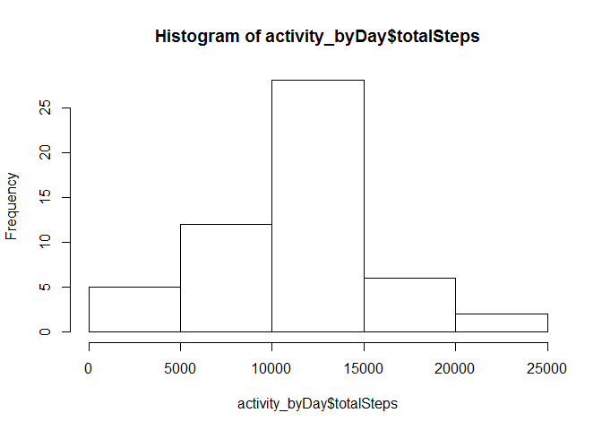
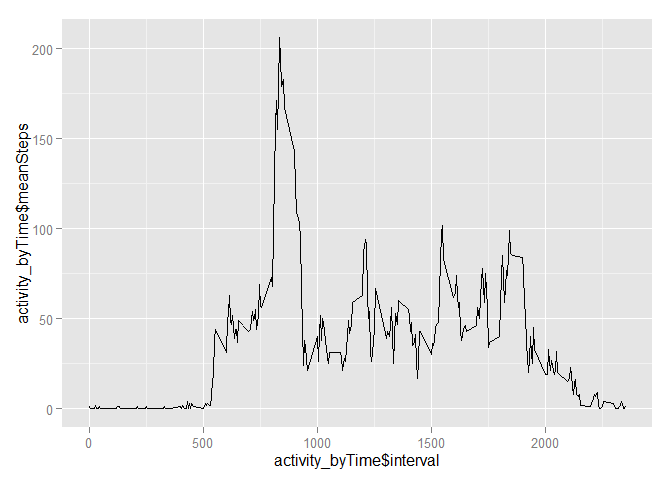
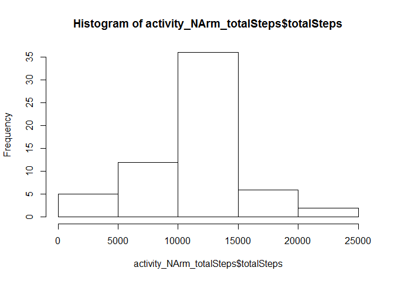
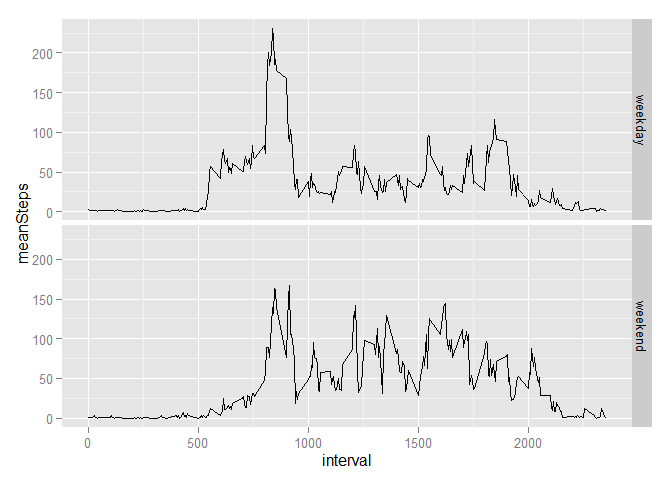

# Reproducible Research: Peer Assessment 1


## Loading and preprocessing the data
The data is in a '.csv' file. A quick look in a text editor shows the file has a header row. We don't need the date as a factor, so let's just read it as it is.
The data also seems to be in a long form (each column is an independent variable; each row is a new observation). SO we can leave that as it is.

```r
activity <- read.csv("activity/activity.csv", as.is = T)
#Give the data a look.
str(activity)
```

```
## 'data.frame':	17568 obs. of  3 variables:
##  $ steps   : int  NA NA NA NA NA NA NA NA NA NA ...
##  $ date    : chr  "2012-10-01" "2012-10-01" "2012-10-01" "2012-10-01" ...
##  $ interval: int  0 5 10 15 20 25 30 35 40 45 ...
```

```r
# we have NAs, which we will deal with later on.
```


## What is mean total number of steps taken per day?
To calculate the 'total number of steps taken per day', we will use the 'dplyr' library to group the data by the 'date' column and sum up the steps over 'intervals' in a day.

```r
library(dplyr)
#Here we are removing the na.rm terms while summing up the steps
activity_byDay <- activity %>% group_by(date) %>% 
    summarise(totalSteps = sum(steps, na.rm = F))
hist(activity_byDay$totalSteps)
```

 

```r
#We can use this new column to calculate mean and median of daily steps.
#Since steps should be whole numbers, round it off to the next number.
meanDailySteps = ceiling(mean(activity_byDay$totalSteps, na.rm = T))
medianDailySteps = ceiling(median(activity_byDay$totalSteps, na.rm = T))
```
> Mean Daily Steps: **10767 **  
> Median Daily Steps: **10765 **


## What is the average daily activity pattern?
Daily activity pattern is the activity done in a day over every 5 minute interval.
To calculate this, we need to group the data by the 'interval' column.

```r
library(ggplot2)
library(lubridate)
activity_byTime <- activity %>% group_by(interval) %>% 
    summarise(meanSteps = floor(mean(steps, na.rm=T)))
#plotting the average daily activity pattern
qplot(y = activity_byTime$meanSteps, x =activity_byTime$interval, geom = "line")
```

 
  
The graph shows that the person is most active in the middle of the day; which sounds reasonable (and normal).

```r
#The time period with max steps can be found by querying the meanSteps column
timePeriod_MaxSteps <- which.max(activity_byTime$meanSteps)
#converting the interval number to hours and minutes
strftime(Sys.Date() + 
             hm(paste("0:", activity_byTime$interval[timePeriod_MaxSteps], sep = "")), format="%H:%M:%S")
```

```
## [1] "13:55:00"
```
> The most active time interval is: **835**. The time of the day then is: **1:55 pm**.


## Imputing missing values
> The total number of rows with NAs is: 2304. This accounts for 13.1147541 % of the data.

Now about the imputations. Looking at the data, there are some days where all 'step' data is NA. Also we see there is difference in activity between different times of a day. SO we can not use average readings for a day. 
We can average the data for a time period over all days and use that to fill up the NAs. That might be more consistent.

We can create a column with the mean steps and then copy over the value where steps are `NA`.

```r
#calculation of total NA rows. Count the number of non-complete cases
sum(!complete.cases(activity))
```

```
## [1] 2304
```

```r
#imputing
#Using dplyr to group data by interval, calculating mean steps
activity_NArm <- activity %>% select(1:3) %>% group_by(interval) %>% 
    mutate(meanSteps = ceiling(mean(steps, na.rm=T)))

#Copy the mean where the value for step column is NA
activity_NArm$steps[is.na(activity_NArm$steps)] <- activity_NArm$meanSteps[is.na(activity_NArm$steps)]

#checking to ensure the new data set is equal to the original in dimension
#The number of rows need to be the same
nrow(activity_NArm) == nrow(activity)
```

```
## [1] TRUE
```

```r
#calculate total steps
activity_NArm_totalSteps <- activity_NArm %>% group_by(date) %>%
    summarise(totalSteps = sum(steps))
hist(activity_NArm_totalSteps$totalSteps)
```

 

```r
meanDailySteps_NArm = ceiling(mean(activity_NArm_totalSteps$totalSteps, na.rm = T))
medianDailySteps_NArm = ceiling(median(activity_NArm_totalSteps$totalSteps, na.rm = T))
```
> Mean Daily Steps **After Imputation**: **10785 **  
> Median Daily Steps **After Imputation**: **10909 **  
> Mean Daily Steps **Before Imputation**: **10767 **  
> Median Daily Steps **Before Imputation**: **10765 **  
The values do change after imputation. But the difference is not much as only a samll portion of the data was imputed.


## Are there differences in activity patterns between weekdays and weekends?
To separate the weekdays from weekends, we need to find out the day of the week from the dates given. We can use the `chron` package to check if a date is a weekend or not.


```r
library(chron)
activity_NArm$w <- as.factor(is.weekend(as.Date(activity_NArm$date)))
levels(activity_NArm$w) <- c("weekday", "weekend")
activity_NArm <- activity_NArm %>% 
    group_by(w, interval) %>% 
    summarise(meanSteps = ceiling(mean(steps)))

g <- ggplot(data = activity_NArm, aes(x = interval, y=meanSteps))
g + geom_line(stat = "identity") + facet_grid(w ~ .)
```

 

The graphs show a clear peak in activity during weekdays. Weekends seem to have a more consistent step count all during the day.
